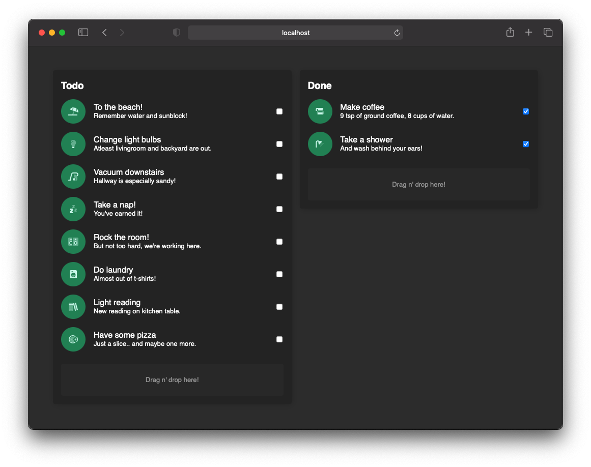

## Robu's rekryhimmeli

Starter-kit for recruitment tasks Uses webpack for asset management. Javascript compilation is configured for React and vanilla javascript for styles you can use css, scss or sass. Static files are served from `public` folder. For html needs make your changes in `src/template.html`.

**NOTE:** Usage of fontawesome icons is only allowed within this reposotory as maintainer has pro-subscription. Copying content to be used elsewhere is strictly forbidden!

### Scripts

Pre-configured scripts to work with project. Nothing special needed here. Should work with LTS node verion (currently v14.17.1).
|Script|Description|
|-|-|
|`npm install`| Installs all project dependencies|
|`npm start`| Starts webpack with dev-server configuration to [http://localhost:9000](http://localhost:9000)|
|`npm test`| Runs jest, should reach all `*.test.js` files|
|`npm build`| Creates production build with webpack with `src/main.js` as entrypoint|

## Recruitment task

Task can be completed either with react or vanilla js. For react implementations start your code from the `src/ReactApp` -folder. Vanilla js solution can start from `src/main.js`.

###

Your task is to create simple todo list app.

1. Fetch data from our mock API
2. Render it into two columns: "pending" and "done".
3. Add functionality to mark task as done. Marking task as done/undone should re-locate to corresponding column.
4. Style the list according the designs below
5. **BONUS** implement [HTML Drag and Drop API](https://developer.mozilla.org/en-US/docs/Web/API/HTML_Drag_and_Drop_API) to drag tasks from one column to the other. [W3schools](https://www.w3schools.com/html/html5_draganddrop.asp) example is good enough for mvp.

End result should look somehting like this. Theme is presetted in `main.css`


## Icons

Project contains a subset of FontAwesome icons: icon for each task and a spinner. Icons are used with like so:

```html
<i class="fad fa-spinner-third fa-spin fa-fw"></i>
```

**NOTE** use this for spinner (DOM example).

## Mock API

Below is documentation for our Promise -based mock API. All reponses have `Content-Type: application/json` Create new instance of mock API:

```javascript
import MockApi from 'MockApi';

const api = new MockApi();
```

**NOTE:** Api usage examples expect that you have initialized api as above

### Schema: ToDoItem

Each item from todo API has following schema

```
ToDoItem {
    task: String
    icon: String
    description: String
    id: Number
    done: Boolean
}
```

**NOTE** To display icon of the task in DOM assign the `icon` string as `class`/`className` for `i` -tag. Below is a react example.

```
<i className={ToDoItem.icon} />
```

### `MockAPI.getTodos`

Returns a [Response](https://developer.mozilla.org/en-US/docs/Web/API/Response) object similar to `fetch`.

```
Response {
    body: ReadableStream
    status: Number,
    statusText: String,
    headers: Headers
}
```

Extract data from reponse with `body.json()` method.

```javascript
async function getData() {
  const response = await api.getTodos();
  const todos = await response.json();
  // ... do something with todos
}
```
